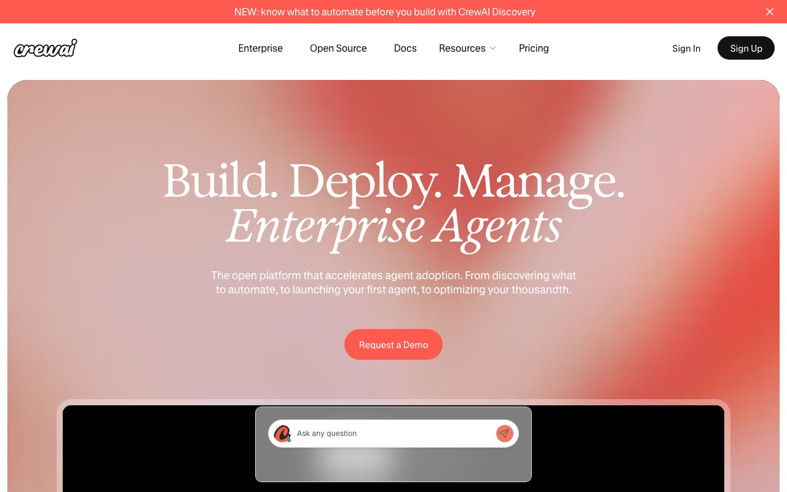
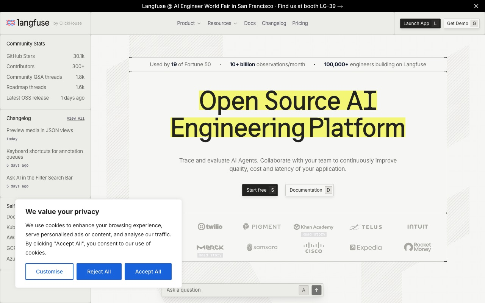
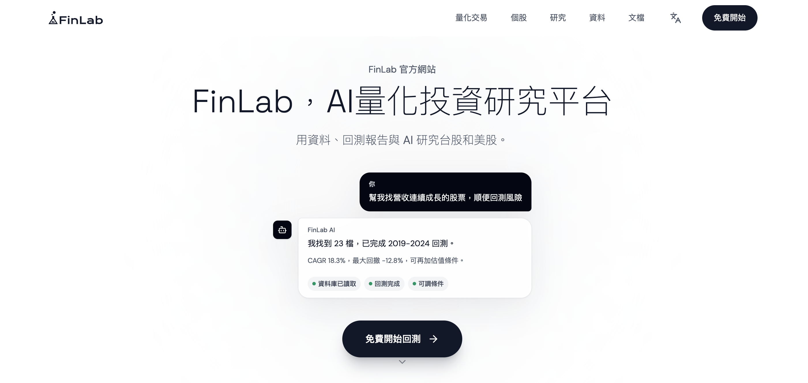

# Awesome Claude Design

> **Claude Design** — Anthropic Labs' AI design workspace. DESIGN.md files grouped by aesthetic family, remix recipes, prompt packs with example outputs, skills, video teardowns, and launch-week community signal.

<p align="center">
  
</p>

<p align="center">
  
</p>

<p align="center">
  <a href="https://awesome.re"></a>
  <a href="https://github.com/rohitg00/awesome-claude-design/stargazers"></a>
  <a href="https://github.com/rohitg00/awesome-claude-design/network/members"></a>
  <a href="https://github.com/rohitg00/awesome-claude-design/commits/main"></a>
  <a href="https://www.anthropic.com/news/claude-design-anthropic-labs"></a>
  <a href="https://www.anthropic.com"></a>
  <a href="LICENSE"></a>
</p>

<p align="center">
  <a href="#1-editorial-minimalism"></a>
  <a href="#2-terminal-core"></a>
  <a href="#3-warm-editorial"></a>
  <a href="#4-data-dense-pro"></a>
  <a href="#5-cinematic-dark"></a>
  <a href="#6-playful-color"></a>
  <a href="#7-glass--soft-futurism"></a>
  <a href="#8-neon-brutalist"></a>
  <a href="#9-cult--indie-picks-non-fortune-500"></a>
</p>

Claude Design shipped **April 17, 2026**. Figma closed **−4.26%** the same day. YouTube split between "RIP frontend developers" and "another slop feature." This repo collects both.

> **Heads up — typo-squat alert.** A repo named `anthropic-claude-design/claude-design` claiming to "download Claude Design" is NOT affiliated with Anthropic. The real product lives at [claude.ai/design](https://claude.ai/design) behind a Pro/Max/Team/Enterprise login. No download exists. Report the typo-squat.

## Preview Gallery

What each aesthetic family actually looks like in production. Thumbnails are static screenshots of the public homepage of one representative brand per family. Click the image to open the live site, click the caption to open the working `DESIGN.md` in this repo.

<table>
<tr>
<td align="center" width="33%">
<a href="https://linear.app"></a><br>
<sub><b><a href="design-md/editorial/linear.md">Linear · editorial</a></b><br><code>#fff / #0f0f14 / #5e6ad2</code></sub>
</td>
<td align="center" width="33%">
<a href="https://ollama.com"></a><br>
<sub><b><a href="design-md/terminal/ollama.md">Ollama · terminal</a></b><br><code>#000 / #fff / mono</code></sub>
</td>
<td align="center" width="33%">
<a href="https://www.anthropic.com"></a><br>
<sub><b><a href="design-md/warm/claude.md">Claude · warm</a></b><br><code>#f4f3ee / #c96442 / #191817</code></sub>
</td>
</tr>
<tr>
<td align="center" width="33%">
<a href="https://clickhouse.com"></a><br>
<sub><b><a href="design-md/data-dense/clickhouse.md">ClickHouse · data-dense</a></b><br><code>#181818 / #faff69 / magenta</code></sub>
</td>
<td align="center" width="33%">
<a href="https://crewai.com"></a><br>
<sub><b><a href="design-md/data-dense/crewai.md">CrewAI · data-dense</a></b><br><code>#0b0e14 / #ff5e4d / ok #2dd4a7 / fail #f0506a</code></sub>
</td>
<td align="center" width="33%">
<a href="https://langfuse.com"></a><br>
<sub><b><a href="design-md/data-dense/langfuse.md">Langfuse · data-dense</a></b><br><code>#f6f5ef / #0a0a0a / highlight #f5f56b</code></sub>
</td>
</tr>
<tr>
<td align="center" width="33%">
<a href="https://finlab.finance"></a><br>
<sub><b><a href="design-md/data-dense/finlab.md">FinLab · data-dense</a></b><br><code>#fff / #2563eb / gain #16a34a / loss #dc2626</code></sub>
</td>
<td align="center" width="33%">
<a href="https://runwayml.com"></a><br>
<sub><b><a href="design-md/cinematic/runway.md">Runway · cinematic</a></b><br><code>#000 / magenta + cyan</code></sub>
</td>
<td align="center" width="33%">
<a href="https://www.figma.com"></a><br>
<sub><b><a href="design-md/playful/figma.md">Figma · playful</a></b><br><code>#0acf83 / #f24e1e / #a259ff</code></sub>
</td>
</tr>
<tr>
<td align="center" width="33%">
<a href="https://arc.net"></a><br>
<sub><b><a href="design-md/glass/arc.md">Arc · glass</a></b><br><code>#fff / radial pastel</code></sub>
</td>
<td align="center" width="33%">
<a href="https://www.theverge.com"></a><br>
<sub><b><a href="design-md/brutalist/the-verge.md">The Verge · brutalist</a></b><br><code>#ff6600 / #000 / #fff</code></sub>
</td>
<td align="center" width="33%">
<a href="https://www.granola.ai"></a><br>
<sub><b><a href="design-md/indie/granola.md">Granola · indie</a></b><br><code>#faf8f2 / warm glass</code></sub>
</td>
</tr>
</table>

<sub>Screenshots are public-homepage stills used for editorial reference. Trademarks remain with their respective owners. See <a href="assets/previews/ATTRIBUTION.md">ATTRIBUTION.md</a> for source URLs and refresh policy.</sub>

## Contents

- [Preview Gallery](#preview-gallery)
- [What Is Claude Design](#what-is-claude-design)
- [Video Teardowns](#video-teardowns)
- [Comparisons](#comparisons)
- [Showcase](#showcase)
- [Community Takes](#community-takes)
- [Feature Map](#feature-map)
- [Launch Timeline](#launch-timeline)
- [Quotas & Token Budget](#quotas--token-budget)
- [Official Resources](#official-resources)
- [X Signal](#x-signal)
- [DESIGN.md by Aesthetic Family](#designmd-by-aesthetic-family)
- [Remix Recipes](#remix-recipes)
- [Picker: What Should I Use](#picker-what-should-i-use)
- [Prompts & Cookbooks](#prompts--cookbooks)
- [Anti-Slop Kit](#anti-slop-kit) — including [Claude Design's default fingerprints](#claude-designs-default-fingerprints-avoid)
- [Skills & Plugins](#skills--plugins)
- [Integrations](#integrations)
- [Workflows & Recipes](#workflows--recipes)
- [Long-Form Tutorials](#long-form-tutorials)
- [International Coverage](#international-coverage)
- [Tips & Tricks](#tips--tricks)
- [Podcast Coverage](#podcast-coverage)
- [FAQ](#faq)
- [Related OSS Projects](#related-oss-projects)
- [Tag System](#tag-system)
- [Contributing](#contributing)
- [License](#license)

---

## What Is Claude Design

Anthropic Labs product. Conversation-to-artifact loop for prototypes, design systems, slides, one-pagers, landing pages, marketing graphics, brand videos. Powered by **Claude Opus 4.7** (vision model). Research preview on **Pro, Max, Team, Enterprise** plans. Rolling out throughout launch day.

Three surfaces:
- **Prototypes** — from text, screenshot, Figma `.fig`, repo URL, or scraped live site
- **Design systems** — persistent per-project tokens/components via `DESIGN.md`; teams hold multiple
- **Collateral** — pitch decks, marketing pages, carousels, one-time posts, brand videos

## Video Teardowns

Click thumbnail. View counts refresh live via shields.io.

<table>
<tr>
<td align="center" width="25%">
<a href="https://www.youtube.com/watch?v=IkspcJdeP3U"></a><br>
<b>Malewicz</b><br>
 <br>
<sub>Skeptical senior-designer teardown</sub>
</td>
<td align="center" width="25%">
<a href="https://www.youtube.com/watch?v=o4jIKc_DIoM"></a><br>
<b>02ui · Murat Bayral</b><br>
 <br>
<sub>vs Lovable head-to-head</sub>
</td>
<td align="center" width="25%">
<a href="https://www.youtube.com/watch?v=uhQfErAzdiA"></a><br>
<b>WorldofAI</b><br>
 <br>
<sub>Hype walkthrough</sub>
</td>
<td align="center" width="25%">
<a href="https://www.youtube.com/watch?v=Qct36RA3y9k"></a><br>
<b>Ray Fernando</b><br>
 <br>
<sub>Live blog redesign</sub>
</td>
</tr>
<tr>
<td align="center" width="25%">
<a href="https://www.youtube.com/watch?v=A2eEv3KYGPg"></a><br>
<b>Vivek Mishra</b><br>
 <br>
<sub>Launch-day walkthrough</sub>
</td>
<td align="center" width="25%">
<a href="https://www.youtube.com/watch?v=4q2F4zblOLQ"></a><br>
<b>AI for Work</b><br>
 <br>
<sub>System from prompt</sub>
</td>
<td align="center" width="25%">
<a href="https://www.youtube.com/watch?v=vyLaimDeK_g"></a><br>
<b>Greg Isenberg</b><br>
 <br>
<sub>Hands-on edges</sub>
</td>
<td align="center" width="25%">
<a href="https://www.youtube.com/watch?v=Hcvkc1XUhMg"></a><br>
<b>Ramanpal Singh</b><br>
 <br>
<sub>Beginner tutorial</sub>
</td>
</tr>
</table>

## Comparisons

| Feature | Claude Design | [Figma Make](https://www.figma.com/make) | [Lovable](https://lovable.dev) | [v0](https://v0.dev) | [Stitch](https://stitch.withgoogle.com) | [SuperDesign](https://github.com/superdesigndev/superdesign) |
|---|---|---|---|---|---|---|
| Prompt → hi-fi | Yes | Yes | Yes | Yes | Yes | Yes |
| DESIGN.md native | **Yes** | No | Partial | No | Originated | Yes |
| Screenshot → system | Yes | No | Partial | No | Yes | Yes |
| Figma `.fig` import | Yes | Native | Yes | Partial | No | No |
| Web capture on live site | **Native** | No | Partial | No | No | Partial |
| Inline comments / knobs | **Yes** | Yes | No | No | No | No |
| Persistent per-project tokens | **Yes** | Yes | Partial | No | No | Yes |
| Org-scoped collab + group chat | **Yes** | Yes | No | No | No | No |
| Export paths | Canva/PDF/PPTX/HTML | Figma | Full-stack app | React | HTML | Local files |
| Multi-system per team | **Yes** | Yes | No | No | No | Yes |
| Open source | No | No | No | No | No | **Yes (MIT)** |
| Runs in your IDE | No | No | No | No | No | **Yes** |
| Underlying model | Opus 4.7 | GPT-based | Claude/GPT | GPT + Claude | Gemini | BYO |
| Pricing | Pro/Max/Team/Ent. | Figma Pro add-on | Freemium | Freemium | Free beta | Free |

Launch-week consensus: **Claude Design** wins design-system coherence, web capture, collaboration. **Lovable** wins full-stack shipping. **Figma Make** is safest for Figma teams. **Stitch** is strongest for pure token generation. **SuperDesign** is the only open-source option that lives inside the IDE.

### More launch-week comparisons

- [TechCrunch — Anthropic launches Claude Design](https://techcrunch.com/2026/04/17/anthropic-launches-claude-design-a-new-product-for-creating-quick-visuals/) — mainstream-press launch framing: "quick visuals" tool, not a Figma killer
- [Adweek — Claude Design for marketing assets, decks, and UIs](https://www.adweek.com/media/anthropic-debuts-claude-design-for-building-marketing-assets-decks-and-uis/) — agency angle, marketing-first read of the surface area
- [PYMNTS — Anthropic's design tool rivals Adobe and Figma](https://www.pymnts.com/artificial-intelligence-2/2026/anthropics-new-design-tool-rivals-adobe-and-figma/) — competitive positioning against the incumbent stack
- [Trending Topics — Anthropic challenges Lovable and Figma](https://www.trendingtopics.eu/anthropic-launches-claude-design-challenging-lovable-and-figma/) — EU coverage; Lovable framed as the closer competitor than Figma
- [Storyboard18 — Claude Design rattles design software giants](https://www.storyboard18.com/digital/what-is-claude-design-anthropics-new-ai-tool-rattles-design-software-giants-ws-l-95581.htm) — India-market read on the ripple to Figma/Adobe
- [Web And IT News — Hits Figma where it hurts](https://www.webanditnews.com/2026/04/20/claude-design-hits-figma-where-it-hurts-ai-eats-into-non-designer-users/) — argues the wedge is non-designers, not designers
- [DEV (whoffagents) — CD vs Figma: what actually changed](https://dev.to/whoffagents/claude-design-tool-vs-figma-what-actually-changed-and-when-to-use-each-3gj) — practitioner side-by-side on when to reach for which
- [MindStudio — Claude Design vs Figma](https://www.mindstudio.ai/blog/claude-design-vs-figma) — feature-grid comparison from the AI-tools vendor angle
- [Magic Patterns — Claude Design vs Figma Make](https://www.magicpatterns.com/blog/claude-design-vs-figma-make) — narrow head-to-head on the prompt-to-prototype surface
- [eigent.ai — Claude Design vs Lovable, full 2026 comparison](https://www.eigent.ai/blog/claude-design-vs-lovable) — pricing + output-quality split between design tool and full-stack builder
- [NxCode — Vibe design tools 2026: Stitch vs v0 vs Lovable vs Bolt](https://www.nxcode.io/resources/news/vibe-design-tools-compared-stitch-v0-lovable-2026) — places Claude Design in the broader vibe-design landscape
- [Lushbinary — Claude Design vs Figma vs Canva vs Stitch](https://lushbinary.com/blog/claude-design-vs-figma-canva-google-stitch-comparison/) — four-way matrix including Canva, the export target

## Showcase

Real builds shipped with Claude Design — launch-week seed of 10 cards (Tom's Guide pizza brand in 30 min, Peter Yang's 16-min everything build, Mercury's 90% inference, Brilliant 20→2 prompts, Datadog week→1-conversation, and more).

See [`showcase/README.md`](showcase/README.md). Submit your own via the [Showcase Submission issue template](.github/ISSUE_TEMPLATE/showcase-submission.yml) or PR.

## Community Takes

### Hype

> "Would suck to be Figma right now."
> — [r/ClaudeAI launch thread](https://www.reddit.com/r/ClaudeAI/comments/1so3k1y/)

> "After 29 years of being a designer, this is the only better way of working."
> — [AI for Work](https://www.youtube.com/watch?v=4q2F4zblOLQ)

> "The design system integration feels best in class for AI."
> — [@petergyang](https://x.com/petergyang/status/2045527271650558383)

- [Mejba Ahmed — The visual layer Claude Code was missing](https://www.mejba.me/blog/claude-design-visual-workflow-claude-code) — engineer-positive read: closes the visual gap in the Claude Code loop

### Pushback

> "Just tested it. This is only hype for people that never worked with real UX/UI designers. Another slop feature that will burn tokens."
> — [r/ClaudeAI](https://www.reddit.com/r/ClaudeAI/comments/1so3k1y/)

> "Anthropic is saying 'look at this hand, see the coin?' — I'm going to open the hand, and the coin is not there. But it was never there. The whole goal was so you're not looking at the other hand while they're taking your subscription money."
> — [Malewicz](https://www.youtube.com/watch?v=IkspcJdeP3U)

> "Was Google Stitch or Microsoft Designer or Template Monster the quality of a mid-level designer? No. Is this?"
> — Malewicz, same video

> "Stickley wouldn't have stained pine to look like oak. Truth to materials means the interface should reveal what built it, not pretend to be hand-drawn when it was assembled."
> — [Sam Henri Gold](https://samhenri.gold/blog/20260418-claude-design/), Tavus designer, framing Claude Design through Arts-and-Crafts and predicting a CD↔Claude Code two-way feedback loop

> "Anthropic debuts Claude Design — because who needs designers?"
> — [The Register](https://www.theregister.com/2026/04/17/anthropic_debuts_claude_design/), launch-day headline

> "If your job was the comps, your job was always going to go. The design was never the comps."
> — [Christopher Noessel](https://christophernoessel.medium.com/design-was-never-the-comps-what-i-learned-when-claude-design-dumped-a-dozen-screens-on-me-73893af464ae), IxDA author, after Claude Design dumped a dozen screens on him in one sitting

> "The designers it replaces are not the designers you were worried about replacing."
> — [Malewicz — Will Claude Design replace designers?](https://michalmalewicz.medium.com/will-claude-design-replace-designers-f92623f3befe), companion long-form piece to the YouTube teardown

- [Abhi Chatterjee — Designer's first walkthrough](https://www.designsystemscollective.com/claude-design-just-launched-a-designers-first-walkthrough-c79d7ce47b9b) — burned ~50% of weekly allotment on one design system + one prototype; trained eyes still spot spacing inconsistencies
- [PCWorld — I tried Claude Design for half an hour, I'm already locked out for a week](https://www.pcworld.com/article/3117811/i-tried-claude-design-for-half-an-hour-im-already-locked-out-for-a-week.html) — 30-minute session exhausted the weekly allowance

### The market

Figma (NYSE: FIG) closed **−4.26%** on launch day. Intraday low ~**−7%** per r/FigmaDesign. Adobe unchanged.

- [Victoria Okwuokenye — Claude Design full breakdown](https://medium.com/design-bootcamp/claude-design-is-here-full-breakdown-a32767258fb9) — feature-by-feature read of where Claude Design lands against the incumbent design stack
- [BSWEN — Good enough for professional websites?](https://docs.bswen.com/blog/2026-04-18-claude-design-quality-professional/) — output-quality bar test; argues the gap to "pro site" is narrower than the discourse claims

### The fine print

> "Fun but burns through usage quickly."
> — [@petergyang](https://x.com/petergyang/status/2045527271650558383)

Early Opus 4.7 hallucination reports on long tasks: [r/ClaudeCode thread](https://www.reddit.com/r/ClaudeCode/comments/1so9uta/) — "$120 of API credits, by god is it bad."

- [Ocasio Consulting — Claude Design review](https://ocasioconsulting.com/claude-design-review/) — direct ask for a flat design-seat fee; "rationing creativity goes against the spirit" of the tool

### Forum Pulse

Engineer-class community takes from Hacker News — three threads, three angles.

- [HN #47806725 — main launch thread](https://news.ycombinator.com/item?id=47806725) — competent UI, nothing mind-blowing yet
- [HN #47818700 — "Thoughts and feelings around Claude Design"](https://news.ycombinator.com/item?id=47818700) — 95% of weekly usage gone in a sitting; plaything-not-tool critique
- [HN #47832366 — "Figma's woes compound with Claude Design"](https://news.ycombinator.com/item?id=47832366) — leaf-node output vs full design lifecycle; Figma exposure compounds

## Feature Map

| Capability | Detail |
|---|---|
| Brand onboarding | Claude reads codebase + design files, builds system automatically on first run |
| Web capture | Grab live elements from your site so prototypes match production |
| File imports | DOCX, PPTX, XLSX, images, Figma `.fig`, repo URL, text |
| Inline comments | Comment on specific elements the way you would in Figma |
| Adjustment knobs | Live sliders for spacing, color, layout — apply across the design |
| Design-system coverage | Colors, typography, components, preview cards, working UI kit, exportable `SKILL.md` |
| Collaboration | Org-scoped sharing — private, view-only, edit access with group Claude chat |
| Export | Canva, PDF, PPTX, standalone HTML, shareable internal URL, saved folder |
| Code handoff | Bundle → Claude Code with one instruction (CSS vars + component stubs) |
| Frontier features | Voice, video, shaders, 3D, built-in AI outputs |
| Videos | Per @petergyang: "creates beautiful videos, more so than slides" |

## Launch Timeline

| Date | Event | Source |
|---|---|---|
| 2026-04-10 | Canva announces Anthropic collaboration (Canva Foundation Design Model partnership) at Canva Create LA | [Canva newsroom](https://www.canva.com/newsroom/news/canva-claude-design/) · [Morningstar / BusinessWire](https://www.morningstar.com/news/business-wire/20260410843169/canva-announces-anthropic-collaboration-to-bring-ai-powered-design-to-millions) |
| 2026-04-14 | The Information leaks Opus 4.7 + design tool | [r/singularity +889](https://www.reddit.com/r/singularity/comments/1slh72j/) |
| 2026-04-14 | Mike Krieger (Anthropic CPO) steps off Figma board — pre-launch signal | [Martin Alderson](https://martinalderson.com/posts/anthropic-figma-supplier-conflict/) |
| 2026-04-17 | Claude Design + Opus 4.7 ship in research preview | [anthropic.com](https://www.anthropic.com/news/claude-design-anthropic-labs) |
| 2026-04-17 | Official launch tweet | [@claudeai](https://x.com/claudeai/status/2045156267690213649) |
| 2026-04-17 | r/ClaudeAI launch thread hits 2,293 upvotes | [Reddit](https://www.reddit.com/r/ClaudeAI/comments/1so3k1y/) |
| 2026-04-17 | Figma closes −4.26% (second thread 1,763 upvotes) | [Reddit](https://www.reddit.com/r/ClaudeAI/comments/1so6z2t/) · [@brewmarkets](https://x.com/brewmarkets/status/2045175784554283228) |
| 2026-04-17 | r/FigmaDesign reports ~7% intraday dip | [Reddit](https://www.reddit.com/r/FigmaDesign/comments/1soc1ic/) |
| 2026-04-17 | Mainstream press wave — TechCrunch, VentureBeat, Adweek frame the launch | [TechCrunch](https://techcrunch.com/2026/04/17/anthropic-launches-claude-design-a-new-product-for-creating-quick-visuals/) · [VentureBeat](https://venturebeat.com/ai/anthropic-launches-claude-design-ai-design-tool/) · [Adweek](https://www.adweek.com/media/anthropic-debuts-claude-design-for-building-marketing-assets-decks-and-uis/) |
| 2026-04-17 | Austin Lau (Anthropic growth marketer) — first-party Tweaks-panel demo + Claude Cowork landing-page recreation | [@helloitsaustin](https://x.com/helloitsaustin/status/2045176910569980318) |
| 2026-04-18 | Teardown wave: Isenberg, Malewicz, 02ui, Ray Fernando, WorldofAI, Vivek Mishra, AI for Work | See [Video Teardowns](#video-teardowns) |
| 2026-04-18 | @petergyang 16-min build: video + slides + website + app + design system | [Tweet](https://x.com/petergyang/status/2045527271650558383) |
| 2026-04-18 | Sam Henri Gold publishes "Stickley joinery" framing post | [samhenri.gold](https://samhenri.gold/blog/20260418-claude-design/) |
| 2026-04-18 | Brilliant + Datadog case studies surface in Anthropic launch post | [anthropic.com](https://www.anthropic.com/news/claude-design-anthropic-labs) |
| 2026-04-18 | MacStories hands-on by John Voorhees — Apple-press POV; "comment-on-element covered 95% of what's needed" | [macstories.net](https://www.macstories.net/stories/hands-on-with-anthropic-labs-claude-design-preview/) |
| 2026-04-19 | Ryan Mather publishes 7-tip thread (system-first, comments-not-chat, connectors) | [@Flomerboy](https://x.com/Flomerboy/status/2045162321589252458) |
| 2026-04-19 | ADPList community surfaces "10x designer with Claude Design" framing — `/packages/ui` subdirectory pro-tip | [adplist.substack.com](https://adplist.substack.com/p/how-to-become-a-10x-designer-with) |
| 2026-04-20 | Follow-on coverage — "hits Figma where it hurts" / "rattles design giants" | [Web And IT News](https://www.webanditnews.com/2026/04/20/claude-design-hits-figma-where-it-hurts-ai-eats-into-non-designer-users/) · [Storyboard18](https://www.storyboard18.com/digital/what-is-claude-design-anthropics-new-ai-tool-rattles-design-software-giants-ws-l-95581.htm) |
| 2026-04-21 | Pricing controversy — Pro tier loses Claude Code access | [Pasquale Pillitteri](https://pasqualepillitteri.it/en/news/591/ai-app-builders-comparison-2026) |
| 2026-04-21 | DESIGN.md spec open-sourced by Google (Stitch / Google Labs) | [blog.google](https://blog.google/technology/google-labs/) |
| 2026-04-22 | Anthropic publishes Claude Design subscription usage + pricing doc | [support.claude.com](https://support.claude.com/en/articles/14667344-claude-design-subscription-usage-and-pricing) |
| 2026-04-22 | Post-launch coverage consolidates — Lenny mini-episode + Quasa.io tips + Anthropic pricing doc | [Lenny's Newsletter](https://www.lennysnewsletter.com/p/what-claude-design-is-actually-good) · [Quasa.io](https://quasa.io/media/claude-design-looks-great-but-it-devours-your-token-limits-here-s-how-to-use-it-smartly) · [support.claude.com](https://support.claude.com/en/articles/14667344-claude-design-subscription-usage-and-pricing) |

## Quotas & Token Budget

Quota burn is the #2 community complaint after AI-slop fingerprints. Here's the math + the recipe so you don't lose a week to a single prompt.

- **Separate meter from chat.** Claude Design has its own usage meter, distinct from regular Claude.ai chat — per the [Anthropic pricing doc](https://support.claude.com/en/articles/14667344-claude-design-subscription-usage-and-pricing).
- **Per-user, not pooled.** Weekly allowance is per-seat — teams cannot share a pool — per the [Anthropic pricing doc](https://support.claude.com/en/articles/14667344-claude-design-subscription-usage-and-pricing).
- **One-time promotional credit.** Roughly 20 typical prompts, expiring **2026-07-17** — per the [Anthropic pricing doc](https://support.claude.com/en/articles/14667344-claude-design-subscription-usage-and-pricing). Spend it on experiments, save weekly allowance for production.
- **Vision tokens cost ~3x text.** Opus 4.7 vision pricing is broadly cited; every screenshot, `.fig`, or web-capture inflates the bill.
- **Pro can exhaust in 2–3 prompts.** Multiple reports on the [r/ClaudeAI launch thread](https://www.reddit.com/r/ClaudeAI/comments/1so3k1y/) of two prompts eating 95% of a weekly limit.
- **30 minutes → locked out for a week.** [PCWorld](https://www.pcworld.com/article/3117811/i-tried-claude-design-for-half-an-hour-im-already-locked-out-for-a-week.html) review burned the full allowance in one sitting.
- **50% of weekly allotment for one design system + one prototype.** Designer field report from [Abhi Chatterjee](https://www.designsystemscollective.com/claude-design-just-launched-a-designers-first-walkthrough-c79d7ce47b9b).
- **"Rationing creativity goes against the spirit."** [Ocasio Consulting](https://ocasioconsulting.com/claude-design-review/) calls directly for a flat design-seat fee.
- **Concrete USD costs on Max-5x: $3 landing / $4 video / $7 deck.** [CopyRocket AI](https://copyrocket.ai/i-tested-claude-design-on-my-real-brand) tested on a real brand and burned 90% of weekly allowance in 4–5 prompts. Definitive token-budget reference.
- **Image generation is "powered in part by Canva."** [Lalindra (Pen With Paper)](https://medium.com/pen-with-paper/claude-design-review-i-spent-a-day-with-it-heres-what-actually-happens-441922202ef2) surfaces that Claude Design's image generation routes through the Canva Design Engine partnership — explains some of the quota dynamics around visual exports.

Recommended sequence: [`recipes/token-budget-claude-design.md`](recipes/token-budget-claude-design.md) — scaffold once, cap reference screens at 4, switch to inline comments for iteration, branch for variants, bundle to Claude Code in one shot.

Full pricing reference: [Claude Design subscription usage and pricing — support.claude.com](https://support.claude.com/en/articles/14667344-claude-design-subscription-usage-and-pricing).

## Official Resources

- [Launch — anthropic.com/news/claude-design-anthropic-labs](https://www.anthropic.com/news/claude-design-anthropic-labs)
- [Product — claude.ai/design](https://claude.ai/design)
- [Anthropic Labs](https://www.anthropic.com/labs)
- [Anthropic Prompt Library](https://docs.anthropic.com/en/resources/prompt-library/library) — Brand builder, Website wizard, Prose polisher, 40+ more
- [`anthropics/skills` — `frontend-design` SKILL.md](https://github.com/anthropics/skills/blob/main/skills/frontend-design/SKILL.md) — the underlying skill Claude Design routes through; auto-loaded by Claude Code for UI work
- [`anthropics/skills` PR #210](https://github.com/anthropics/skills/pull/210) — clarity revision; 75% win rate across model tiers, biggest lift on Haiku
- [`anthropics/claude-cookbooks` — frontend aesthetics notebook](https://github.com/anthropics/claude-cookbooks/blob/main/coding/prompting_for_frontend_aesthetics.ipynb) — Anthropic's own anti-slop primer; quoted in [Anti-Slop Kit](#anti-slop-kit)
- [Claude Cookbooks — prompting_for_frontend_aesthetics.ipynb](https://github.com/anthropics/claude-cookbooks/blob/main/coding/prompting_for_frontend_aesthetics.ipynb)
- [Prompt engineering overview](https://docs.anthropic.com/en/docs/build-with-claude/prompt-engineering/overview)
- [Prompt generator (Console)](https://docs.anthropic.com/en/docs/build-with-claude/prompt-engineering/prompt-generator)

## X Signal

Launch-week reactions with receipts.

| Handle | Angle | Quote | Link |
|---|---|---|---|
| [@claudeai](https://x.com/claudeai/status/2045156267690213649) | Official | "Introducing Claude Design by Anthropic Labs. Powered by Claude Opus 4.7, our most capable vision model." | Tweet |
| [@petergyang](https://x.com/petergyang/status/2045527271650558383) | Hands-on PM | "Design system integration feels best in class for AI. Creates beautiful videos, more so than slides. Fun but burns through usage quickly." | Tweet |
| [@brewmarkets](https://x.com/brewmarkets/status/2045175784554283228) | Markets | "Figma stock is tumbling after Anthropic introduces Claude Design." | Tweet |

Submit more: handle, verbatim quote ≤280 chars, tweet URL, engagement numbers.

<p align="center"></p>

## DESIGN.md by Aesthetic Family

Not sorted by industry. Sorted by **visual character** — because that's how designers actually pick. Each family links to (1) a working `DESIGN.md` in `/design-md/<family>/`, (2) canonical external references, (3) a one-line swatch + type spec so you can eyeball fit before cloning.

**Shipped samples in this repo:** [warm/claude.md](design-md/warm/claude.md) · [warm/mercury.md](design-md/warm/mercury.md) · [terminal/ollama.md](design-md/terminal/ollama.md) · [terminal/warp.md](design-md/terminal/warp.md) · [terminal/opencode.md](design-md/terminal/opencode.md) · [editorial/linear.md](design-md/editorial/linear.md) · [editorial/vercel.md](design-md/editorial/vercel.md) · [data-dense/clickhouse.md](design-md/data-dense/clickhouse.md) · [data-dense/posthog.md](design-md/data-dense/posthog.md) · [data-dense/datadog.md](design-md/data-dense/datadog.md) · [data-dense/mongodb.md](design-md/data-dense/mongodb.md) · [data-dense/finlab.md](design-md/data-dense/finlab.md) · [data-dense/crewai.md](design-md/data-dense/crewai.md) · [data-dense/langfuse.md](design-md/data-dense/langfuse.md) · [cinematic/runway.md](design-md/cinematic/runway.md) · [cinematic/tavus.md](design-md/cinematic/tavus.md) · [cinematic/cohere.md](design-md/cinematic/cohere.md) · [cinematic/nvidia.md](design-md/cinematic/nvidia.md) · [cinematic/minimax.md](design-md/cinematic/minimax.md) · [cinematic/bmw.md](design-md/cinematic/bmw.md) · [cinematic/ferrari.md](design-md/cinematic/ferrari.md) · [cinematic/lamborghini.md](design-md/cinematic/lamborghini.md) · [cinematic/renault.md](design-md/cinematic/renault.md) · [playful/figma.md](design-md/playful/figma.md) · [playful/canva.md](design-md/playful/canva.md) · [playful/toss.md](design-md/playful/toss.md) · [glass/arc.md](design-md/glass/arc.md) · [glass/apple.md](design-md/glass/apple.md) · [brutalist/the-verge.md](design-md/brutalist/the-verge.md) · [indie/granola.md](design-md/indie/granola.md) · [remix/linear-x-claude.md](design-md/remix/linear-x-claude.md) · [remix/warp-x-sentry.md](design-md/remix/warp-x-sentry.md) · [remix/stripe-x-a24.md](design-md/remix/stripe-x-a24.md) · [remix/vercel-x-pitchfork.md](design-md/remix/vercel-x-pitchfork.md) · [remix/granola-x-criterion.md](design-md/remix/granola-x-criterion.md) · [remix/ollama-x-elevenlabs.md](design-md/remix/ollama-x-elevenlabs.md) · [remix/notion-x-duolingo.md](design-md/remix/notion-x-duolingo.md) · [remix/mercury-x-linear.md](design-md/remix/mercury-x-linear.md)

### 1. Editorial Minimalism

Calm neutrals, serif or narrow-grotesque headlines, generous line-height, single accent. Built for reading, pricing pages, docs.

| Brand | Swatch | Type | External reference |
|---|---|---|---|
| Linear | `#fff / #0f0f14 / #5e6ad2` | Inter / Söhne | [linear.app](https://linear.app) |
| Stripe | `#fff / #0a2540 / #635bff` | Sohne / Camphor | [stripe.com](https://stripe.com) |
| Vercel | `#fff / #000 / single grayscale ramp` | Geist | [vercel.com](https://vercel.com) |
| Mintlify | `#fff / #0c0c0e / green accent` | Inter reading-optimized | [mintlify.com](https://mintlify.com) |

### 2. Terminal-Core

Monospace everywhere, phosphor-green or amber on near-black, hard edges, CLI metaphors.

| Brand | Swatch | Type | External reference |
|---|---|---|---|
| Ollama | `#000 / #fff / no accent` | Mono | [ollama.com](https://ollama.com) |
| Warp | `#0b0d14 / #16d5e6 / #ff7a59` | Roobert + JetBrains Mono | [warp.dev](https://warp.dev) |
| Raycast | `#1d1d1f / #ff6363 / white` | Custom sans + mono | [raycast.com](https://raycast.com) |
| OpenCode | `#080808 / #d2d2d2 / green` | IBM Plex Mono | [opencode.ai](https://opencode.ai) |

### 3. Warm Editorial

Terracotta, cream, clay. Serif body, approachable, human. Claude's own brand sits here.

| Brand | Swatch | Type | External reference |
|---|---|---|---|
| Claude / Anthropic | `#f4f3ee / #c96442 / #191817` | Styrene / Tiempos | [anthropic.com](https://anthropic.com) |
| Notion | `#fff / #37352f / warm grays` | Segoe + Lyon serif | [notion.so](https://notion.so) |
| Resend | `#0a0a0a / #fff / mono accents` | Söhne + GT America Mono | [resend.com](https://resend.com) |
| Substack | `#fff / #1a1a1a / #ff6719` | Spectral + SF Pro | [substack.com](https://substack.com) |

### 4. Data-Dense Pro

Charts are the hero. Tight spacing, saturated categorical palette, fixed-width numerals, dark-first dashboards.

| Brand | Swatch | Type | External reference |
|---|---|---|---|
| ClickHouse | `#181818 / #faff69 / magenta` | Inter tabular | [clickhouse.com](https://clickhouse.com) |
| PostHog | `#1d4aff / #f9bd2b / #000` | Matter + Mono | [posthog.com](https://posthog.com) |
| Grafana | `#111217 / #f47c1b / multi-series` | Inter | [grafana.com](https://grafana.com) |
| Sentry | `#362d59 / #f6827d / #584774` | Rubik | [sentry.io](https://sentry.io) |
| Supabase | `#171717 / #3ecf8e` | Custom + mono | [supabase.com](https://supabase.com) |
| MongoDB | `#001e2b / #00ed64 / #00684a` | Euclid Circular A + Source Code Pro | [mongodb.com](https://mongodb.com) |
| FinLab | `#ffffff / #2563eb / #16a34a gain / #dc2626 loss` | Inter tabular + CJK stack | [finlab.finance](https://finlab.finance) |
| CrewAI | `#0b0e14 / #ff5e4d / #2dd4a7 ok / #f0506a fail` | Inter tabular + JetBrains Mono | [crewai.com](https://crewai.com) |
| Langfuse | `#f6f5ef / #0a0a0a / #f5f56b highlight` | Inter tabular + JetBrains Mono | [langfuse.com](https://langfuse.com) |

### 5. Cinematic Dark

Film-grade gradients, oversized type, motion-forward, media-heavy hero. Built for AI products and creator tools.

| Brand | Swatch | Type | External reference |
|---|---|---|---|
| RunwayML | `#000 / saturated magenta + cyan` | Custom grotesque | [runwayml.com](https://runwayml.com) |
| ElevenLabs | `#0a0a0a / electric blue / wave motifs` | Inter | [elevenlabs.io](https://elevenlabs.io) |
| Minimax | `#000 / neon lime on charcoal` | Custom + mono | [minimax.ai](https://minimax.ai) |
| Midjourney | `#000 / earth tones + lilac` | Editorial serif | [midjourney.com](https://midjourney.com) |
| NVIDIA | `#000 / #76b900 signature green / #ffffff` | NVIDIA Sans / Helvetica Neue | [nvidia.com](https://nvidia.com) |
| BMW | `#fff / #1c69d4 corporate blue / M-gradient` | BMW Type Next Web + Helvetica Neue | [bmw.com](https://bmw.com) |
| Ferrari | `#000 / #fff / #eb2323 Rosso Corsa` | FerrariSans | [ferrari.com](https://ferrari.com) |
| Lamborghini | `#000 / #ffc000 warm gold / hex motif` | LamboType + Roboto | [lamborghini.com](https://lamborghini.com) |
| Renault | `#fff / aurora yellow→magenta→cyan / #efdf00 + #e91630` | NouvelR | [renault.fr](https://renault.fr) |

### 6. Playful Color

High-saturation, illustrated accents, rounded corners, decorative shapes. Consumer-friendly.

| Brand | Swatch | Type | External reference |
|---|---|---|---|
| Figma | `#0acf83 / #f24e1e / #a259ff / #ff7262 / #1abcfe` | Inter + Whyte | [figma.com](https://figma.com) |
| Clay | `#f6e9c9 / organic shapes / soft gradients` | Söhne | [clay.com](https://clay.com) |
| Duolingo | `#58cc02 / #fff / #ff4b4b` | DIN Rounded | [duolingo.com](https://duolingo.com) |
| Mailchimp | `#ffe01b / #000` | Cooper Hewitt + GT America | [mailchimp.com](https://mailchimp.com) |
| Cal.com | `#292929 / #fff / single accent` | Inter | [cal.com](https://cal.com) |
| Toss | `#fff / #3182f6 Toss Blue / #191f28` | Toss Product Sans + Noto Sans KR | [toss.im](https://toss.im) |

### 7. Glass / Soft-Futurism

Frosted blur, layered translucency, soft gradients, Apple-adjacent. Premium consumer feel.

| Brand | Swatch | Type | External reference |
|---|---|---|---|
| Apple | `#fff / #1d1d1f / system colors` | SF Pro | [apple.com](https://apple.com) |
| Arc Browser | `#fff / radial pastel gradients` | Custom | [arc.net](https://arc.net) |
| Airbnb | `#fff / #ff385c / #222` | Cereal | [airbnb.com](https://airbnb.com) |
| Granola | `#faf8f2 / warm glass` | Editorial serif | [granola.ai](https://granola.ai) |
| Spotify | `#000 / #1db954` | Circular | [spotify.com](https://spotify.com) |

### 8. Neon Brutalist

Hard edges, deliberate-ugly type mixing, oversized numerals, saturated single hue. Statement pieces.

| Brand | Swatch | Type | External reference |
|---|---|---|---|
| Bugatti | `#0d1321 / electric blue / chrome` | Custom + GT America | [bugatti.com](https://bugatti.com) |
| PlayStation | `#000 / full-spectrum prism` | SST | [playstation.com](https://playstation.com) |
| The Verge | `#ff6600 / #000 / #fff` | Polysans + editorial serif | [theverge.com](https://theverge.com) |
| Pitchfork | `#fff / #000 / #ff5d1f` | Editorial serif | [pitchfork.com](https://pitchfork.com) |

### 9. Cult / Indie Picks (non-Fortune-500)

Brands VoltAgent's catalog does NOT cover — indie SaaS, cult tools, magazines, museums, game studios. Maintainer bias: these are the ones worth cloning.

| Brand | Why | External reference |
|---|---|---|
| Thesephist / Ink & Switch | Research-publication aesthetic | [thesephist.com](https://thesephist.com) |
| Paradigm | Crypto-firm minimal serif | [paradigm.xyz](https://paradigm.xyz) |
| Criterion Collection | Film archive editorial | [criterion.com](https://criterion.com) |
| A24 | Cinema brand-as-artifact | [a24films.com](https://a24films.com) |
| Letterboxd | Dark cinephile social | [letterboxd.com](https://letterboxd.com) |
| ProPublica | Investigative journalism density | [propublica.org](https://propublica.org) |
| Dimension.dev | Dev-tool soft-gradient | [dimension.dev](https://dimension.dev) |
| Granola | AI notetaker warmth | [granola.ai](https://granola.ai) |
| Superhuman | Premium email minimalism | [superhuman.com](https://superhuman.com) |
| Obsidian | Personal-knowledge dark | [obsidian.md](https://obsidian.md) |

### External catalogs

The DESIGN.md ecosystem is bigger than this repo. We catalog only what others don't — these are the upstreams, mirrors, sibling lists, and origin-spec sources worth bookmarking.

**DESIGN.md ecosystem**

- [**VoltAgent/awesome-claude-design**](https://github.com/VoltAgent/awesome-claude-design)  — 68 brand DESIGN.md files, industry-sorted (the canonical industry catalog)
- [**VoltAgent/awesome-design-md**](https://github.com/VoltAgent/awesome-design-md)  — 59+ brands in Stitch-format, every entry ships preview.html (tool-agnostic twin)
- [**philquist/awesome-claude-design-examples**](https://github.com/philquist/awesome-claude-design-examples)  — community mirror/fork of the VoltAgent collection, useful as a discovery surface
- [**getdesign.md**](https://getdesign.md/) — browseable web UI for 60+ DESIGN.md files (Cursor, Vercel, Warp, Claude, Mistral, xAI, Tesla, Renault, Revolut, Wise, Linear, PostHog)
- [**google-labs-code/design.md**](https://github.com/google-labs-code/design.md)  — official DESIGN.md spec from Google Labs Code, Apache 2.0; see [`docs/spec.md`](https://github.com/google-labs-code/design.md/blob/main/docs/spec.md)

**Topic hubs**

- [**github.com/topics/design-md**](https://github.com/topics/design-md) — auto-rolling repo feed for the format itself
- [**github.com/topics/claude-design**](https://github.com/topics/claude-design) — Claude Design–tagged repos (skills, examples, tooling)

**Awesome-Claude meta-lists**

- [**rohitg00/awesome-claude-code-toolkit**](https://github.com/rohitg00/awesome-claude-code-toolkit)  — sibling meta-toolkit: 135 agents, 35 skills, 42 commands, 176 plugins
- [**hesreallyhim/awesome-claude-code**](https://github.com/hesreallyhim/awesome-claude-code)  — the original awesome-claude-code list; hosts Patrick Ellis's Design Review Workflow entry
- [**jqueryscript/awesome-claude-code**](https://github.com/jqueryscript/awesome-claude-code)  — surfaces claude-design-engineer (1.1k stars) and excalidraw-diagram-skill (1.2k stars)
- [**sickn33/antigravity-awesome-skills**](https://github.com/sickn33/antigravity-awesome-skills)  — 1,431+ skills incl. Leonxlnx/taste-skill (Stitch design systems, brutalist/minimalist modes)
- [**ComposioHQ/awesome-claude-skills**](https://github.com/ComposioHQ/awesome-claude-skills)  — claude.ai + Code + API portability emphasis; ships canvas-design SKILL.md
- [**BehiSecc/awesome-claude-skills**](https://github.com/BehiSecc/awesome-claude-skills)  — security-flavoured skill list with design-engineering crossover
- [**travisvn/awesome-claude-skills**](https://github.com/travisvn/awesome-claude-skills)  — curated skills with subagent guidance and authoring conventions
- [**heilcheng/awesome-agent-skills**](https://github.com/heilcheng/awesome-agent-skills)  — multi-agent (Claude/Cursor/Codex/Gemini) skills with explicit awesome-design-md cross-link
- [**quemsah/awesome-claude-plugins**](https://github.com/quemsah/awesome-claude-plugins)  — design-engineering plugins with craft / memory / enforcement framing
- [**awesomeclaude.ai**](https://awesomeclaude.ai) — web directory across awesome-claude-* repos with an awesome-claude-agents subsection

**Tooling & extractors**

- [**yuvrajangadsingh/brandmd**](https://github.com/yuvrajangadsingh/brandmd)  — `npx brandmd https://linear.app` produces DESIGN.md / CSS custom properties / Tailwind v4 / dark-mode overrides; no LLM calls; ships as an Agent Skill across 30+ platforms
- [**bitjaru/styleseed**](https://github.com/bitjaru/styleseed)  — 69 design rules + 48 shadcn components + Toss/Stripe/Linear/Vercel/Notion brand skins; teaches LLMs how designers think rather than just what brands look like
- [**Muluk-m/design-distill**](https://github.com/Muluk-m/design-distill)  — Stitch-compatible DESIGN.md generator with pre-bundled github / linear / notion / stripe / vercel snapshots; works with Codex, Claude Code, and any AI client
- [**bergside/design-md-chrome**](https://github.com/bergside/design-md-chrome)  — Chrome / Firefox / Edge extension that extracts DESIGN.md + SKILL.md from any site in TypeUI format ([Chrome Web Store listing](https://chromewebstore.google.com/detail/designmd-style-extractor/ogpdnchdjiibhobphelbbkemnnemkfma)); designer-friendly path with no terminal required

**Background reading**

- [**OSS Insight — DESIGN.md Protocol 2026**](https://ossinsight.io/blog/design-md-protocol-2026) — historical timeline of awesome-design-md going viral; useful framing for how the format spread
- [**Google Stitch open-source announcement**](https://medium.com/design-bootcamp/google-makes-design-md-open-source-on-its-way-to-become-a-industry-standard-16119f2368dd) — fernandocomet's coverage of Google open-sourcing the DESIGN.md spec
- [**MindStudio — What Is Design.md**](https://www.mindstudio.ai/blog/what-is-design-md) — primer on the format for non-designers / tool buyers

<p align="center"></p>

## Remix Recipes

Single-brand clones get generic fast. Mix tokens across families for novel looks.

| Name | Recipe | Feel |
|---|---|---|
| **Linear × Claude** | Linear's typography + Claude's terracotta accent + warm neutrals | Editorial SaaS with a soul |
| **Warp × Sentry** | Warp's mono grid + Sentry's lilac → purple | Developer-tool dashboard that doesn't feel cold |
| **Stripe × A24** | Stripe's layout discipline + A24's poster boldness | Fintech pitch deck with personality |
| **Vercel × Pitchfork** | Vercel's grayscale ramp + Pitchfork's orange | Editorial docs site |
| **Granola × Criterion** | Granola's warmth + Criterion's editorial rigor | Premium note app with gravitas |
| **Ollama × ElevenLabs** | Terminal mono + cinematic dark gradients | CLI tool landing page |
| **Notion × Duolingo** | Notion's neutrals + Duolingo's greens | Friendly education SaaS |
| **Mercury × Linear** | Mercury's cream + indigo + Linear's surgical density | Fintech dashboard with editorial warmth |

Ship your remix: `/design-md/remix/<name>.md` + screenshot. PR it.

## Picker: What Should I Use

Three questions. Pick a family.

1. **Is your product read-heavy or scan-heavy?**
   - Read-heavy → [Editorial Minimalism](#1-editorial-minimalism) or [Warm Editorial](#3-warm-editorial)
   - Scan-heavy → [Data-Dense Pro](#4-data-dense-pro) or [Terminal-Core](#2-terminal-core)

2. **Who's the user?**
   - Developer → [Terminal-Core](#2-terminal-core) or [Data-Dense Pro](#4-data-dense-pro)
   - Designer / creator → [Cinematic Dark](#5-cinematic-dark) or [Playful Color](#6-playful-color)
   - Consumer → [Glass / Soft-Futurism](#7-glass--soft-futurism) or [Playful Color](#6-playful-color)
   - Prosumer → [Warm Editorial](#3-warm-editorial)

3. **Does the brand need to feel like it took courage?**
   - Yes → [Neon Brutalist](#8-neon-brutalist) or [Cult / Indie Picks](#9-cult--indie-picks-non-fortune-500)
   - No → Stay in families 1-7

## Prompts & Cookbooks

### Official (Anthropic)

- [Anthropic Prompt Library](https://docs.anthropic.com/en/resources/prompt-library/library) — 40+ prompts including **Brand builder**, **Website wizard**, **Prose polisher**
- [claude-cookbooks / prompting_for_frontend_aesthetics.ipynb](https://github.com/anthropics/claude-cookbooks/blob/main/coding/prompting_for_frontend_aesthetics.ipynb) — official anti-slop notebook
- [System prompts release notes](https://docs.anthropic.com/en/release-notes/system-prompts)

### Community gists & prompt repos

- [**superdesigndev/superdesign**](https://github.com/superdesigndev/superdesign)  — open-source design agent in the IDE by [@jasonzhou1993](https://x.com/jasonzhou1993) and [@jackjack_eth](https://x.com/jackjack_eth). Parallel Claude Code agents, infinite canvas UX. [Show HN](https://news.ycombinator.com/item?id=44376003)
- [**jonthebeef/superdesign-mcp-claude-code**](https://github.com/jonthebeef/superdesign-mcp-claude-code)  — MCP server wiring SuperDesign into Claude Code, no API key
- [**Owl-Listener/designer-skills**](https://github.com/Owl-Listener/designer-skills)  — Designer Skills Collection by MC Dean. MIT
- [**Owl-Listener/designpowers**](https://github.com/Owl-Listener/designpowers)  — specialist design agents, Direct + Auto modes. MIT
- [**saifyxpro/ui-ux-design-pro-skill**](https://github.com/saifyxpro/ui-ux-design-pro-skill)  — styles, palettes, fonts, reasoning rules, platform templates
- [**nextlevelbuilder/ui-ux-pro-max-skill**](https://github.com/nextlevelbuilder/ui-ux-pro-max-skill)  — professional UI/UX across platforms
- [**alirezarezvani/claude-skills**](https://github.com/alirezarezvani/claude-skills)  — skills across engineering, marketing, product, compliance
- [**NicholasSpisak — Design with Claude Code**](https://gist.github.com/NicholasSpisak/7cb9db221b0b7c4c4aaf9ffca21a847c) — `design.md` prompt with three design-professional personas in live debate
- [**abhishekray07/claude-md-templates**](https://github.com/abhishekray07/claude-md-templates)  — CLAUDE.md + `api-design.md` rule template
- [**smartwhale8/claude-playbook**](https://github.com/smartwhale8/claude-playbook)  — production `.claude/` scaffolding, GitHub template
- [**VoltAgent/awesome-agent-skills**](https://github.com/VoltAgent/awesome-agent-skills) — 1000+ skills incl. `design-md`, `enhance-prompt`, `react-components`, `shadcn-ui`
- [**daymade/claude-code-skills**](https://github.com/daymade/claude-code-skills) — production-ready Claude Code skills marketplace

### Prompt packs shipped here (`/prompts`)

Every pack includes the full prompt, an example run with expected output, quality checks, and variations.

| Pack | Purpose | File |
|---|---|---|
| `brand-to-design-md` | URL → full DESIGN.md with 9 canonical sections | [`/prompts/brand-to-design-md.md`](prompts/brand-to-design-md.md) |
| `audit-live-site` | URL → scored audit (hierarchy, spacing, a11y, AI-slop) + punch list | [`/prompts/audit-live-site.md`](prompts/audit-live-site.md) |
| `3-designer-debate` | Three-voice critique with synthesis + minority reports | [`/prompts/3-designer-debate.md`](prompts/3-designer-debate.md) |
| `remix-two-brands` | Combine two DESIGN.md files with explicit token arbitration | [`/prompts/remix-two-brands.md`](prompts/remix-two-brands.md) |
| `family-picker` | 3 questions → recommended family + 2 reference DESIGN.md files | [`/prompts/family-picker.md`](prompts/family-picker.md) |

Index: [`/prompts/README.md`](prompts/README.md)

## Anti-Slop Kit

Drop this fragment into Claude Design's system prompt or any Claude Code project. Sourced from Anthropic's [frontend aesthetics cookbook](https://github.com/anthropics/claude-cookbooks/blob/main/coding/prompting_for_frontend_aesthetics.ipynb):

```
NEVER use generic AI-generated aesthetics:
- Overused font families (Inter, Roboto, Arial, system fonts)
- Cliched color schemes (purple gradients on white or dark backgrounds)
- Predictable layouts and component patterns
- Cookie-cutter design that lacks context-specific character

DO use:
- Unique fonts chosen for the brand, not defaults
- Cohesive colors and themes grounded in the product's story
- Animations for effects and micro-interactions
- Context-specific character in every component
```

Malewicz's [teardown](https://www.youtube.com/watch?v=IkspcJdeP3U)  opens by flagging Claude Design's own logo as "generic, color palette" — exactly the trap this prompt is built to avoid.

### Claude Design's default fingerprints (avoid)

The single biggest community complaint: every Claude Design output looks the same. Catalogued from launch-week Reddit threads, the [Sam Henri Gold blog post](https://samhenri.gold/blog/20260418-claude-design/), the [Banani review](https://www.banani.co/blog/claude-design-review), and [The Neuron Daily round-up](https://www.theneurondaily.com/p/anthropic-s-claude-design-launched-and-reddit-has-thoughts).

| Fingerprint | What it looks like | Counter-rule |
|---|---|---|
| **Teal accent everywhere** | The default `#16d5e6`-adjacent action color appears on CTA, headline accent, focus rings, and chart fill | Pick a brand-specific accent in your DESIGN.md before the first generation |
| **Blinking status dot** | Animated green/lime dot top-right of nav, signals "live"/"AI" by reflex | Reject in your prompt: "no animated status indicators" |
| **Container soup** | Pills wrapping cards wrapping cards wrapping content; padding stacking 24/24/24 | Cap nesting depth: "containers nest at most 2 levels" |
| **Default serif headline** | Tiempos- or Source-Serif-adjacent serif paired with sans body — reads like the Anthropic brand's leftovers | Specify font stack with explicit weight + tracking, not a vibe |
| **Accent bar left of every card** | 4px coloured rule on every card, regardless of semantic meaning | Reserve left-rule for one role (e.g. severity) — never as decoration |
| **Three-column feature grid in hero** | Almost every landing the model produces has the same section-2 layout | Brief: "no three-column feature grid; choose marquee, alternating-row, or single-column instead" |
| **Lucide icon stack** | Default icon set across nav, buttons, empty states | Either commit to a single icon family (Phosphor / Heroicons / custom) or ship type-only |
| **Generative hero in product palette ignored** | Image generator picks colors that "look right" but ignore the DESIGN.md tokens | Constrain the image: "regenerate hero using only `--bg`, `--accent`, `--text`" |

Use the dedicated prompt pack [`prompts/break-default-aesthetic.md`](prompts/break-default-aesthetic.md) to neutralize these in one paste.

### How the defaults got there

Claude Design routes through Anthropic's open-source [`frontend-design` skill](https://github.com/anthropics/skills/blob/main/skills/frontend-design/SKILL.md) — the same skill Claude Code auto-loads for UI work. The skill's defaults bias toward "production-quality first pass" which, in the absence of a DESIGN.md, lands on the same look every time.

Two related Anthropic resources worth bookmarking:

- [**frontend-aesthetics cookbook**](https://github.com/anthropics/claude-cookbooks/blob/main/coding/prompting_for_frontend_aesthetics.ipynb) — Anthropic's own anti-slop primer; the source quoted above
- [**`skills` PR #210**](https://github.com/anthropics/skills/pull/210) — clarity revision of the frontend-design skill; 75% win rate across model tiers, biggest lift on Haiku

Anthropic acknowledges the problem in the cookbook: *"You tend to converge toward generic, 'on distribution' outputs. In frontend design, this creates what users call the 'AI slop' aesthetic. Avoid this: make creative, distinctive frontends that surprise and delight."*

### Community anti-slop tools

Beyond Anthropic's own materials, the community has shipped a growing set of skills, plugins, and review workflows specifically aimed at the slop fingerprints catalogued above. Drop-in alternatives or complements to the prompt fragment.

- [**Leonxlnx/taste-skill**](https://github.com/Leonxlnx/taste-skill)  — frontend taste skill: premium UI generation, redesign audits, GSAP motion, brutalist/minimalist/soft variants, 3-dial parameterization (variance, motion, density)
- [**Dammyjay93/interface-design**](https://github.com/Dammyjay93/interface-design)  — design engineering for Claude Code (formerly `claude-design-engineer`): persistent design system file, slash commands for init/audit/extract, enforces token consistency between sessions
- [**coleam00/excalidraw-diagram-skill**](https://github.com/coleam00/excalidraw-diagram-skill)  — diagram skill that argues visually instead of slapping boxes-and-arrows; Playwright render-validate loop catches overlap, misalignment, bad spacing
- [**OneRedOak/claude-code-workflows — design-review**](https://github.com/OneRedOak/claude-code-workflows/tree/main/design-review)  — Patrick Ellis's UI/UX review workflow: subagents + `/design-review` slash command + CLAUDE.md memory integration + accessibility coverage via Playwright MCP
- [**ComposioHQ/awesome-claude-skills — canvas-design**](https://github.com/ComposioHQ/awesome-claude-skills/blob/master/canvas-design/SKILL.md)  — design philosophy expressed visually: two-phase (philosophy → artifact), 90% visual / 10% essential text, anti-template by construction
- [**Marie Claire Dean — 63 design skills**](https://marieclairedean.substack.com/p/i-built-63-design-skills-for-claude) ([repo](https://github.com/Owl-Listener/designer-skills) ) — 63 skills + 27 commands across research, systems, strategy, UI, interaction, prototyping, ops; teaches Claude *what design actually is* beyond image generation. MIT

### Leaked system prompts

What Claude Design's frontend-design skill actually says, sourced from community reverse-engineering. Read these before tuning your DESIGN.md — every counter-rule above maps back to a default in this prompt.

- [**GordenSun gist — extracted Claude Design system prompt**](https://gist.github.com/GordenSun/b5c6316f078d694645ca466386875296) — full extracted prompt; frames Claude as "an expert designer working with the user as a manager," routes through the Frontend design skill, and instructs the model to "understand visual vocabulary first." Primary anti-slop reference: explains *exactly* why outputs default to the teal-aesthetic fingerprints catalogued above.
- [**hqman gist — alternate system prompt extraction**](https://gist.github.com/hqman/f46d5479a5b663c282c94faa8be866de) — second leaked extraction; cross-reference for divergence between sessions / model tiers. Useful for spotting which directives are stable defaults vs. session-injected variations.

## Skills & Plugins

Claude Code skills and SkillKit plugins that pair with Claude Design.

- [**design-shotgun**](https://github.com/rohitg00/skillkit) — generate N variants, compare side-by-side
- [**design-html**](https://github.com/rohitg00/skillkit) — finalize mockup → production HTML/CSS
- [**design-review**](https://github.com/rohitg00/skillkit) — designer's-eye QA, AI-slop detection
- [**design-consultation**](https://github.com/rohitg00/skillkit) — full system proposal (aesthetic, typography, color, motion)
- [**plan-design-review**](https://github.com/rohitg00/skillkit) — plan-mode critique before implementation
- [**plan-devex-review**](https://github.com/rohitg00/skillkit) — DX audit for developer-facing UI
- [**google-labs-code/design-md**](https://github.com/VoltAgent/awesome-agent-skills) — canonical Stitch DESIGN.md generator
- [**superdesign-mcp**](https://github.com/jonthebeef/superdesign-mcp-claude-code) — SuperDesign as Claude Code MCP server

Install via SkillKit: `npx skillkit install design-shotgun`

### Community installs

The same anti-slop tools listed above, with explicit install commands. Mix and match — most chain cleanly with the SkillKit packs above.

- [**Leonxlnx/taste-skill**](https://github.com/Leonxlnx/taste-skill)  — premium UI gen, redesign audits, GSAP motion, brutalist/minimalist/soft variants
  ```sh
  npx skills add Leonxlnx/taste-skill
  ```
- [**Dammyjay93/interface-design**](https://github.com/Dammyjay93/interface-design)  — persistent design-system memory + `/interface-design:audit` slash command
  ```sh
  git clone https://github.com/Dammyjay93/interface-design ~/.claude/plugins/interface-design
  ```
- [**coleam00/excalidraw-diagram-skill**](https://github.com/coleam00/excalidraw-diagram-skill)  — diagrams that argue visually; render-validate loop
  ```sh
  git clone https://github.com/coleam00/excalidraw-diagram-skill .claude/skills/excalidraw-diagram
  ```
- [**OneRedOak/claude-code-workflows**](https://github.com/OneRedOak/claude-code-workflows/tree/main/design-review)  — Patrick Ellis design-review subagents + `/design-review` + CLAUDE.md excerpts; needs Playwright MCP
  ```sh
  git clone https://github.com/OneRedOak/claude-code-workflows
  cp -r claude-code-workflows/design-review/.claude/* .claude/
  ```
- [**ComposioHQ/awesome-claude-skills — canvas-design**](https://github.com/ComposioHQ/awesome-claude-skills/tree/master/canvas-design)  — design philosophy → poster/PDF artifact, two-phase
  ```sh
  npx skillkit install composio/canvas-design
  ```
- [**Owl-Listener/designer-skills**](https://github.com/Owl-Listener/designer-skills)  — [Marie-Claire Dean's 63 skills + 27 commands + 8 plugins](https://marieclairedean.substack.com/p/i-built-63-design-skills-for-claude), MIT — covering research, systems, strategy, UI, interaction, prototyping, ops, and the toolkit itself
  ```sh
  /plugin marketplace add Owl-Listener/designer-skills
  ```
- [**Snyk — Top 8 Claude Skills for UI/UX Engineers**](https://snyk.io/articles/top-claude-skills-ui-ux-engineers/) — third-party roundup; explains the frontend-design skill (277k+ installs), `ui-ux-pro-max`, and the Vercel companion skills with install commands
- [**Snyk — Top 8 Claude Skills for Entrepreneurs / Founders**](https://snyk.io/articles/top-8-claude-skills-entrepreneurs-startup-founders-solopreneurs/) — companion roundup; design-adjacent skills framed for solo builders, captures the community shift from "will this replace me" to "how do I ship faster"

## Integrations

MCP servers, plugins, and IDE adapters that pair with Claude Design or extend it via Claude Code handoff. Most live outside the product surface — wire them up once, then route Claude Design's exports through them.

### MCP servers

- [**Connect Claude Code to tools via MCP**](https://code.claude.com/docs/en/mcp) — official setup docs, scopes, transport modes
- [**Figma MCP server**](https://www.figma.com/blog/introducing-figmas-dev-mode-mcp-server/) — bridges design-to-code; complements Claude Design's missing Figma export at launch
- [**Adobe AEM MCP**](https://experienceleague.adobe.com/en/docs/experience-manager-cloud-service/content/ai-in-aem/mcp-support/chat-applications/setup-claude) — Claude + AEM setup walkthrough, content authoring from chat

### Curated MCP roundups

- [**TurboDocx — Best Claude Code Plugins/Skills/MCP**](https://www.turbodocx.com/blog/best-claude-code-skills-plugins-mcp-servers) — combined plugin/skill/server list, opinionated picks
- [**claudefa.st — 50+ Best MCP Servers**](https://claudefa.st/blog/tools/mcp-extensions/best-addons) — broad catalog with category tags
- [**Builder.io — How to Use MCP Servers**](https://www.builder.io/blog/claude-code-mcp-servers) — install + config patterns, with examples
- [**Toolradar — Best MCP Servers 2026**](https://toolradar.com/blog/best-mcp-servers-claude-code) — ranked list with workflow notes
- [**LaoZhang — Starter Picks by Workflow**](https://blog.laozhang.ai/en/posts/claude-code-best-mcp-servers) — sorted by use case (research, coding, infra)
- [**MindStudio — Read/Write Apps via MCP**](https://www.mindstudio.ai/blog/how-to-use-mcp-servers-with-claude-code) — turning third-party apps into MCP-readable surfaces

### Frontier features

Claude Design ships built-in AI outputs that previously needed separate tools — **Voice, Video, 3D, and Shaders** are all generated inline (per the [Anthropic launch post](https://www.anthropic.com/news/claude-design-anthropic-labs)). Connectors (Slack, Drive, internal docs) plug into the design loop without extra MCP wiring; high-leverage but burns quota fast.

### Stitch + Claude Design via MCP

- [**Pasquale Pillitteri — Google Stitch MCP, export Claude Code design to code**](https://pasqualepillitteri.it/en/news/647/google-stitch-mcp-export-claude-code-design-to-code) — full Stitch + CD via MCP walkthrough. Covers Stitch's March 2026 update (Vibe Design, Voice Canvas, multi-screen flows, 350 free generations/month) and React/Vue/Angular/Flutter/SwiftUI export wired through MCP into Claude Code, Cursor, or Gemini CLI.

### Canva integration

- [**Canva newsroom — Canva and Claude Design**](https://www.canva.com/newsroom/news/canva-claude-design/) — Canva-side official partnership announcement
- [**Morningstar / BusinessWire — Canva announces Anthropic collaboration**](https://www.morningstar.com/news/business-wire/20260410843169/canva-announces-anthropic-collaboration-to-bring-ai-powered-design-to-millions) — Apr 10 press wire, four days before Krieger's Figma resignation and seven days before launch
- Per [Lalindra's hands-on at Pen With Paper](https://medium.com/pen-with-paper/claude-design-review-i-spent-a-day-with-it-heres-what-actually-happens-441922202ef2), Claude Design is "powered in part" by the Canva Foundation Design Model and supports HTML import for round-tripping Canva-built layouts back into the editor.

### Enterprise / Cowork admin

- [**Anthropic — Claude Design admin guide for Team and Enterprise plans**](https://support.claude.com/en/articles/14604406-claude-design-admin-guide-for-team-and-enterprise-plans) — official 4-phase rollout (designers → full design team → broader → org-wide), custom roles, design-system-setup-first ordering, and the data-residency caveat (CD does not currently support residency requirements)
- [**Anthropic — Claude Cowork enterprise administrator guide**](https://claude.com/resources/tutorials/claude-cowork-enterprise-administrator-guide) — adjacent admin context covering Cowork-side controls that intersect with CD provisioning

### Limitations to know

- **Figma export not yet available at launch** — round-trip back into Figma is manual; use the Figma MCP server above for token sync
- **No live-cursor multiplayer** — Figma-style co-editing is not in the product
- **Sharing is org-scoped URL with view/edit only** — no public links, no per-element permissions
- **Inferred design system can mis-deduce edge cases** — auto-extracted tokens drift on outliers; review before locking ([agence-scroll guide](https://agence-scroll.com/en/blog/claude-design-anthropic-2026-guide))

## Workflows & Recipes

End-to-end flows in `/recipes/<name>.md`.

1. [**Landing page in 20 minutes**](recipes/landing-page-20-min.md) — DESIGN.md → Claude Design → Claude Code → Vercel
2. [**Figma file → DESIGN.md**](recipes/figma-to-design-md.md) — drag `.fig` in chat, extract tokens, reuse
3. [**Existing repo → design system**](recipes/repo-to-design-system.md) — point Claude at your CSS, get canonical DESIGN.md back
4. [**Wireframe → hi-fi**](recipes/wireframe-to-hifi.md) — low-fi sketch to pixel-perfect comp
5. [**Pitch deck from README**](recipes/pitch-deck-from-readme.md) — 12-slide deck from a project README
6. [**Brand extraction**](recipes/brand-extraction.md) — URL → DESIGN.md describing a competitor's system
7. **Design-system governance** — lock tokens as `SKILL.md` for every future project
8. [**Web capture → prototype**](recipes/web-capture-to-prototype.md) — use the native capture tool on your live site
9. **16-minute everything build** — per @petergyang: video + slides + website + app + initial system
10. **Two-brand remix** — combine tokens from two DESIGN.md files coherently
11. **Claude Design → Canva export** — designer collaboration pathway
12. **Org-wide design-system sharing** — view-only URL, group-chat edit mode
13. [**Token budget for Claude Design**](recipes/token-budget-claude-design.md) — ship a project on a single Pro plan in a week without burning quota
14. [**Frontier 3D / shaders / voice / video**](recipes/frontier-3d-shaders.md) — build with Claude Design's native generation surfaces; cites Anthropic launch + Ileana Marcut's 3D Helix portfolio
15. [**Tweaks panel — no-regen iteration**](recipes/tweaks-panel-sidebar.md) — reorder sections and swap variants without burning chat tokens; Austin Lau's sidebar workflow
16. [**Comment-paste workaround**](recipes/comment-paste-workaround.md) — paste the would-be chat prompt as an inline comment; the MacStories "95%" pattern
17. [**Speaker notes from a pitch deck**](recipes/speaker-notes-pitch-deck.md) — extract delivery-ready notes from a generated deck; pairs with `pitch-deck-from-readme`

<p align="center"></p>

## Long-Form Tutorials

The writing worth reading after the launch dust settled. Grouped by platform.

### Substack

| Title | Author | URL | Value |
|---|---|---|---|
| Claude Design is here | Department of Product | [departmentofproduct.substack.com](https://departmentofproduct.substack.com/p/claude-design-is-here-everything) | 5 examples + GitHub mock setup + chat-vs-comments split — most tactical first-hour guide |
| Claude Design | Ruben Hassid | [ruben.substack.com](https://ruben.substack.com/p/claude-design) | Admin-toggle setup steps + advanced workflow |
| Founder's Playbook | Linas Beliūnas | [linas.substack.com](https://linas.substack.com/p/claude-design-founders-playbook) | Eight workflows, 7-step logo flow, master prompts; cites Mercury 90% inference |
| How to Actually Use Claude Design | AI For Developers | [aifordevelopers.substack.com](https://aifordevelopers.substack.com/p/how-to-actually-use-claude-design) | The subdirectory-not-monorepo tip in full |
| Claude for Designers Ultimate Guide | Sorted Pixels (nervegna) | [nervegna.substack.com](https://nervegna.substack.com/p/claude-for-designers-the-ultimate) | Three-tier model: novice / practitioner / orchestrator |
| Solopreneur Initial Guide | solopreneurcode | [solopreneurcode.substack.com](https://solopreneurcode.substack.com/p/claude-design-complete-guide-solopreneurs) | Solo-founder-shaped scope, no agency assumptions |
| Everything You Need to Know | getpushtoprod | [getpushtoprod.substack.com](https://getpushtoprod.substack.com/p/everything-you-need-to-know-about) | Four-template workflow: Prototype / Slide / Template / Other |
| I Tested It On Launch Day | aifromthefield | [aifromthefield.substack.com](https://aifromthefield.substack.com/p/i-tested-claude-design-on-launch) | Day-one hands-on, before the takes consolidated |
| What Claude Design is actually good for | Lenny's Newsletter | [lennysnewsletter.com](https://www.lennysnewsletter.com/p/what-claude-design-is-actually-good) | Landing page + slides + "unhinged redesign" stress tests |

### Medium

| Title | Author | URL | Value |
|---|---|---|---|
| I Spent a Day With It — Here's What Actually Happens | Lalindra (Pen With Paper) | [medium.com/pen-with-paper](https://medium.com/pen-with-paper/claude-design-review-i-spent-a-day-with-it-heres-what-actually-happens-441922202ef2) | Surfaces the Canva Design Engine partnership; non-designer POV |
| What Claude Design actually changes for designers | Fanny | [medium.com/design-bootcamp](https://medium.com/design-bootcamp/what-claude-design-actually-changes-for-designers-0c5b04fae343) | Brief → Claude Code pipeline collapse, designer POV |
| What's New, What You Can Build, How to Use It | Ai Studio | [medium.com/the-ai-studio](https://medium.com/the-ai-studio/claude-design-whats-new-what-you-can-build-and-how-to-use-it-92283bfe8c82) | Surface scan covering all three product surfaces |
| The Non-Designer's Walkthrough | Alex P. | [medium.com/@0xmega](https://medium.com/@0xmega/how-to-use-claude-design-the-non-designers-walkthrough-2adc18053a5c) | Six export paths, end-to-end |
| Designer's First Walkthrough | Abhi Chatterjee | [designsystemscollective.com](https://www.designsystemscollective.com/claude-design-just-launched-a-designers-first-walkthrough-c79d7ce47b9b) | "50% of weekly allotment burned in one design system + one prototype" |
| Full Breakdown | Victoria Okwuokenye | [medium.com/design-bootcamp](https://medium.com/design-bootcamp/claude-design-is-here-full-breakdown-a32767258fb9) | Section-by-section product walkthrough |
| Google makes DESIGN.md open source | fernandocomet | [medium.com/design-bootcamp](https://medium.com/design-bootcamp/google-makes-design-md-open-source-on-its-way-to-become-a-industry-standard-16119f2368dd) | DESIGN.md spec context — useful before adopting |

### Blog / Other

| Title | Author | URL | Value |
|---|---|---|---|
| Hands-on with Anthropic Labs' Claude Design Preview | John Voorhees (MacStories) | [macstories.net](https://www.macstories.net/stories/hands-on-with-anthropic-labs-claude-design-preview/) | Apple-press POV — "comment-on-element covered 95% of what's needed" |
| Claude Design Hands-on Review | LLMx Blog | [llmx.tech](https://llmx.tech/blog/claude-design-hands-on-review-2026/) | "First AI design surface that behaves like a designer iterating" |
| How to Use Claude Design for UX/UI | DesignerUp | [designerup.co](https://designerup.co/blog/how-to-use-claude-design-for-ux-ui/) | Education-house framing for design-curious devs |
| Getting Started | Muzli | [muz.li/blog](https://muz.li/blog/getting-started-with-claude-design-a-collaborator-for-your-design-workflow/) | Designer-newsletter intro, low-friction onboarding |
| Good Enough for Professional Websites? | BSWEN | [docs.bswen.com](https://docs.bswen.com/blog/2026-04-18-claude-design-quality-professional/) | Quality bar honest assessment, mostly skeptical |
| The Visual Layer Claude Code Was Missing | Mejba Ahmed | [mejba.me](https://www.mejba.me/blog/claude-design-visual-workflow-claude-code) | Engineer-positive read; pairs with Claude Code workflow |
| 15 Minutes to a Design System | Ocasio Consulting | [ocasioconsulting.com](https://ocasioconsulting.com/claude-design-review/) | Direct ask to Anthropic for a flat design-seat fee |
| Complete Guide | Tosea.ai | [tosea.ai/blog](https://tosea.ai/blog/claude-design-complete-guide) | Reference-doc shape; useful as deep-link target |
| First Impressions | Banani | [banani.co/blog](https://www.banani.co/blog/claude-design-review) | Competitor's review — read with that in mind |
| Anthropic's Answer to Lovable / v0 | Aurora Designs | [aurora-designs.ca](https://aurora-designs.ca/blog/claude-design-anthropic-labs/) | Positions Claude Design in the AI builder field |
| Complete 2026 Guide | agence-scroll | [agence-scroll.com](https://agence-scroll.com/en/blog/claude-design-anthropic-2026-guide) | Agency-side adoption framing |
| Complete Guide for Non-Designers | BuildFastWithAI | [buildfastwithai.com](https://www.buildfastwithai.com/blogs/claude-design-anthropic-guide-2026) | Explicit non-designer scaffolding |
| 2026 Business Guide | Spicy Advisory | [spicyadvisory.com](https://www.spicyadvisory.com/blog/claude-design-anthropic-labs-guide-workflows-2026) | Workflows for SMB / consulting context |
| Features + Pricing | ALM Corp | [almcorp.com](https://almcorp.com/blog/claude-design-anthropic-labs/) | Plain pricing/features summary, low fluff |

## International Coverage

Non-English coverage worth tracking. Different angles, different audiences — useful both for translation reach and because regional press often surfaces angles the US-centric wave misses.

### French

| Source | URL | Value | Lang |
|---|---|---|---|
| La Revue Tech | [larevuetech.fr](https://larevuetech.fr/anthropics-claude-design-wants-to-turn-a-prompt-into-a-prototype-then-hand-it-to-canva-or-code/) | Prompt-to-prototype framing with the Canva/Code handoff angle | FR |
| IT SOCIAL | [itsocial.fr](https://itsocial.fr/contenus/actualites/intelligence-artificielle-actualites-contenus/avec-claude-design-anthropic-ouvre-le-prototypage-visuel-aux-professionnels-sans-competences-en-crea/) | Enterprise-IT POV — opening visual prototyping to non-creative professionals | FR |

### Spanish

| Source | URL | Value | Lang |
|---|---|---|---|
| Web Reactiva | [webreactiva.com](https://www.webreactiva.com/blog/claude-design-probado) | Spanish-language hands-on; tested the Claude Code export path | ES |

### Italian

| Source | URL | Value | Lang |
|---|---|---|---|
| Pasquale Pillitteri — Vibe Coding 2026 comparison | [pasqualepillitteri.it](https://pasqualepillitteri.it/en/news/591/ai-app-builders-comparison-2026) | Detailed AI app-builder comparison incl. Claude Design pricing controversy | IT (EN translation) |
| Pasquale Pillitteri — CD vs Stitch crash analysis | [pasqualepillitteri.it](https://pasqualepillitteri.it/en/news/1027/claude-design-vs-google-stitch-figma-stock-crash) | Italian analysis of the Figma stock crash + Stitch positioning | IT (EN translation) |
| Pasquale Pillitteri — Stitch MCP walkthrough | [pasqualepillitteri.it](https://pasqualepillitteri.it/en/news/647/google-stitch-mcp-export-claude-code-design-to-code) | Stitch MCP Server + Claude Code design-to-code flow in 23 minutes | IT (EN translation) |

### Japanese

| Source | URL | Value | Lang |
|---|---|---|---|
| 金 成奎 (seikei_kin) on X | [x.com/seikei_kin](https://x.com/seikei_kin/status/2032264221644505561) | Marie-Claire Dean 63-skills writeup translated and amplified for the Japanese audience | JA |

PRs adding more international sources welcome — Korean, Chinese, German, Portuguese, and other regional coverage are gaps we'd like to fill. Open an issue or PR with the URL, language tag, and one-line value.

## Tips & Tricks

High-leverage tactics from creators who actually shipped with it. Attribution on every claim.

### Ryan Mather's 7 tips ([thread](https://x.com/Flomerboy/status/2045162321589252458) · [Skills explainer](https://x.com/Flomerboy/status/2034094212161945965))

Anthropic insider, posted day two of launch.

1. **System-first.** Build the design system before any prototype — Claude reuses tokens across every later artifact.
2. **Comment, don't chat.** Inline comments on the canvas cost less and target faster than a new chat turn.
3. **Demo with video.** Drop screen recordings into context; Claude follows motion intent better than written specs.
4. **Connectors to Slack and docs.** Wire up your knowledge sources so brand voice and copy stay consistent (burns quota fast — see weekly allowance note below).
5. **Build custom one-off tools.** Claude can spin a small utility for the exact micro-task instead of you wrestling a generic one.
6. **Slow down at the moments that matter.** Hero, pricing, empty states — let Claude take more passes there, less elsewhere.
7. **Skillify it.** Bundle the working `DESIGN.md` as a `SKILL.md` for cross-project reuse — see the Skills explainer thread for what that unlocks.

### Builder examples worth studying

- **Ran Segall — homeschooling app.** Called Claude Design "10x better than Lovable or Replit" for full-app builds. Read his timeline for prompt cadence.
- **Jerrod Lew — personal dashboard OS in two prompts.** Demonstrates how far one good `DESIGN.md` carries.
- **[Peter Yang — 16-min everything build](https://x.com/petergyang/status/2045527271650558383).** Video + slides + website + app + design system. Also the source of "fun but burns through usage quickly."
- **[Austin Lau (Anthropic growth-marketer) — Tweaks panel + Cowork landing recreation](https://x.com/helloitsaustin/status/2045176910569980318).** Best documentation of the no-regen sidebar workflow — reorder sections, swap variants, then hand off to Claude Code.

### Token economics

- **[Quasa.io — Claude Design token tips](https://www.quasa.io/)** — community write-up on quota survival; pairs with the [`token-budget-claude-design`](recipes/token-budget-claude-design.md) recipe.
- **Promotional credit gets consumed first.** Anthropic ships every paying user a one-time credit equal to a typical $20 prompt; spend it on experimentation, save the weekly allowance for production work.
- **Weekly allowance is per-user, not pooled.** Important when planning team usage — admins can't redistribute someone else's leftover budget.
- Both above per [Anthropic — Claude Design subscription usage and pricing](https://support.claude.com/en/articles/14667344-claude-design-subscription-usage-and-pricing).

### Workflow callouts

- **Connectors to Slack and docs** are the single highest-leverage integration for brand consistency, but also the fastest way to burn weekly allowance. Wire them only on production projects, not exploration.
- **Subdirectory, not monorepo.** Per [AI For Developers](https://aifordevelopers.substack.com/p/how-to-actually-use-claude-design), point Claude Design at one subdirectory per project — full-monorepo context is slow and noisy. One `DESIGN.md` per app, linked from the subdirectory.

## Podcast Coverage

The audio coverage worth queueing. Insider interviews, launch-week reactions, and adjacent context from the v0 / generative-web orbit.

- [Lenny's Podcast — Jenny Wen (head of design at Claude, ex-Figma director), "the design process is dead"](https://www.lennysnewsletter.com/p/the-design-process-is-dead) — anchor episode (March 1, 2026, 1h 17m). Predates launch but lays the philosophical foundation: discovery → mock → iterate is dead, three designer archetypes Anthropic hires, AI taste/judgment, why she left Figma director to return to IC at Anthropic.
- [Lenny's Newsletter mini-episode (Apr 22) — "What Claude Design is actually good for"](https://www.lennysnewsletter.com/p/what-claude-design-is-actually-good) — post-launch reaction. Companion YouTube: ["Claude Design is slow and I love it anyway"](https://www.youtube.com/watch?v=wgPVh9wG6Ok). Landing page + slides + unhinged-redesign tests; CD + GPT Images 2.0 + DESIGN.md side-by-side.
- [AI Daily Brief (Nathaniel Whittemore) — Claude Design episode](https://podcasts.apple.com/us/podcast/the-ai-daily-brief-artificial-intelligence-news/id1680633614) — largest daily AI podcast covering CD; non-design AI audience reach. Best use cases first few days; marketing / decks / wireframes / launch-videos. Companion [Claude Cowork episode](https://open.spotify.com/episode/5krjdNlepb26fNWmcsRjG9).
- [Design Better Podcast — "The Roundup: Our first impressions of Claude Design"](https://designbetterpodcast.com/p/the-roundup-our-first-impressions) — designer-host roundtable. "The interesting problem isn't generating pixels — it's generating pixels that look like *your* product." Not-a-Figma-killer-yet read.
- [Design Better Podcast — Meaghan Choi (Anthropic Product Designer on Claude Code)](https://www.designbetter.co/podcast) — adjacent context: Anthropic designer perspective on the broader Claude product surface (exact episode pending).
- [Sequoia Training Data — Vercel CEO Guillermo Rauch: Building the Generative Web with AI](https://sequoiacap.com/podcast/training-data-guillermo-rauch/) — adjacent context for the v0 / generative-web side of the same wave.
- [Lenny's Podcast — "Everyone's an engineer now: Inside v0's mission" (Guillermo Rauch)](https://www.lennysnewsletter.com/p/everyones-an-engineer-now-guillermo-rauch) — Rauch episode; v0 framing useful for comparison content.
- [AI and I — Vercel's Guillermo Rauch on What Comes After Coding](https://creators.spotify.com/pod/profile/how-do-you-use-chat-gpt/episodes/Vercels-Guillermo-Rauch-on-What-Comes-After-Coding---Ep--47-e2tguf3) — third Rauch take; complements the Sequoia + Lenny episodes.
- [How I AI — "Claude Code for Product Managers"](https://www.lennysnewsletter.com/p/this-week-on-how-i-ai-claude-code) — adjacent PM-focused context; CC perspective applicable to CD workflows.

## FAQ

**Does Claude Design replace Figma?**
Not today. Replaces the first-draft stage (wireframes, comps, pitch decks). Teams still round-trip through Figma for collab, dev handoff, plugins.

**Opus 4.7 required?**
Bundled at launch. Sonnet 4.6 works, produces weaker systems. Long-task hallucination reports are real.

**Figma file import?**
Yes — drag `.fig` in chat. Single pages work well; multi-file libraries hit-or-miss at launch.

**Price?**
Bundled in Pro / Max / Team / Enterprise. Per-seat Team pricing not yet published.

**Will I burn through my Pro quota?**
Almost certainly, if you chat-prompt every change. Reddit reports of "two prompts ate 95% of my weekly limit" are real — Opus 4.7 vision tokens cost roughly 3x equivalent text. Use the [`token-budget-claude-design`](recipes/token-budget-claude-design.md) recipe: scaffold once, cap at 4 reference screens, switch to inline comments for iteration, branch for variants, bundle to Claude Code in one shot. Claude Design has its own quota separate from chat — but if you also use Claude Code, that quota is shared.

**Data training?**
Per Anthropic's policy: no, not by default for paid tiers. Verify on [anthropic.com/legal/privacy](https://www.anthropic.com/legal/privacy) before shipping sensitive work.

**Videos?**
Yes. Per @petergyang, "creates beautiful videos, more so than slides." Greg Isenberg less impressed. Try and decide.

**Open-source alternative?**
[SuperDesign](https://github.com/superdesigndev/superdesign) — runs in your IDE, MIT, BYO model.

**Is `anthropic-claude-design/claude-design` on GitHub real?**
No. Typo-squat. Claude Design lives at [claude.ai/design](https://claude.ai/design) behind a paid login. No download exists.

## Related OSS Projects

| Repo | Stars | What |
|---|---|---|
| [superdesigndev/superdesign](https://github.com/superdesigndev/superdesign) |  | Open-source AI design agent in the IDE, MIT |
| [jonthebeef/superdesign-mcp-claude-code](https://github.com/jonthebeef/superdesign-mcp-claude-code) |  | SuperDesign as Claude Code MCP, no API key |
| [Owl-Listener/designer-skills](https://github.com/Owl-Listener/designer-skills) |  | Designer Skills Collection by MC Dean, MIT |
| [Owl-Listener/designpowers](https://github.com/Owl-Listener/designpowers) |  | Specialist design agents, Direct + Auto modes, MIT |
| [VoltAgent/awesome-claude-design](https://github.com/VoltAgent/awesome-claude-design) |  | Brand DESIGN.md catalog, industry-sorted |
| [VoltAgent/awesome-design-md](https://github.com/VoltAgent/awesome-design-md) |  | Stitch-format DESIGN.md collection |
| [VoltAgent/awesome-agent-skills](https://github.com/VoltAgent/awesome-agent-skills) |  | Skills incl. `design-md`, `shadcn-ui`, `react-components` |
| [saifyxpro/ui-ux-design-pro-skill](https://github.com/saifyxpro/ui-ux-design-pro-skill) |  | Styles, palettes, fonts, CLI |
| [nextlevelbuilder/ui-ux-pro-max-skill](https://github.com/nextlevelbuilder/ui-ux-pro-max-skill) |  | Multi-platform UI/UX skill |
| [alirezarezvani/claude-skills](https://github.com/alirezarezvani/claude-skills) |  | Skills across engineering, product, marketing |
| [daymade/claude-code-skills](https://github.com/daymade/claude-code-skills) |  | Claude Code skills marketplace |
| [abhishekray07/claude-md-templates](https://github.com/abhishekray07/claude-md-templates) |  | CLAUDE.md + rules best practices |
| [smartwhale8/claude-playbook](https://github.com/smartwhale8/claude-playbook) |  | Production `.claude/` GitHub template |
| [NicholasSpisak gist](https://gist.github.com/NicholasSpisak/7cb9db221b0b7c4c4aaf9ffca21a847c) | — | Three-designer debate prompt |
| [anthropics/claude-cookbooks](https://github.com/anthropics/claude-cookbooks) |  | Official Anthropic notebooks |
| [rohitg00/awesome-claude-plugins](https://github.com/rohitg00/awesome-claude-plugins) |  | Claude Code plugin ecosystem |
| [rohitg00/awesome-claude-code-toolkit](https://github.com/rohitg00/awesome-claude-code-toolkit) |  | Hooks, skills, slash commands |
| [rohitg00/skillkit](https://github.com/rohitg00/skillkit) |  | Universal CLI for skills across many agents |
| [hesreallyhim/awesome-claude-code](https://github.com/hesreallyhim/awesome-claude-code) |  | General Claude Code resources |
| [github.com/topics/claude-design](https://github.com/topics/claude-design) | — | Live topic feed |

## Tag System

Inline tag badges used across `DESIGN.md`, prompt packs, recipes, and remix files. Fork and remix freely — sources under [`/assets/tags/`](assets/tags/).

<p align="center">
  
  
  
  
  
  
  
  
  
</p>

## Contributing

Bar: **would a working designer or engineer find this useful in the next 48 hours?**

**Accepted:** original DESIGN.md files in any aesthetic family · remix recipes (two-brand combos) · prompt packs with before/after screenshots · workflow recipes you actually ran · video teardowns > 2K views OR with substantive critique · comparison data with receipts · X-handle quotes with links + engagement · screenshots/GIFs of real output.

**Rejected:** affiliate links · screenshots without reproducible prompts · "cool thing!" with no context · re-packaged VoltAgent entries (link upstream) · slop · emoji-heavy headers · typo-squat repos.

**PR template:** title `[family] brand — one-line value`. Body = swatch + type + reference link + reproducibility notes.

See [CONTRIBUTING.md](CONTRIBUTING.md).

## License

[MIT](LICENSE). Use, fork, remix, ship.

Not affiliated with Anthropic. "Claude" and "Claude Design" are trademarks of Anthropic PBC. Brand names in referenced DESIGN.md files belong to their respective owners — included for educational commentary only.

---

<p align="center"></p>

<p align="center"></p>

<p align="center">
  Maintained by <a href="https://github.com/rohitg00">@rohitg00</a>. PRs welcome.
</p>
